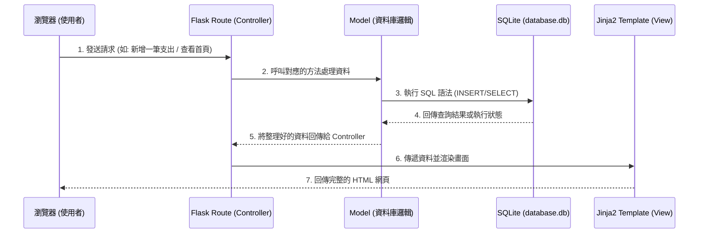

# 系統架構文件 - 個人記帳簿系統

## 1. 技術架構說明

### 選用技術與原因
- **後端：Python + Flask**
  Flask 是一個輕量級的 Web 框架，具有極高的靈活性且易於上手。對於「個人記帳簿系統」這種中小型且功能集中的專案，Flask 能用最少的程式碼快速建立起核心功能。
- **模板引擎：Jinja2**
  與 Flask 完美整合，直接在後端將資料與 HTML 綁定渲染，不需要開發複雜的前端 API 請求邏輯（不用前後端分離），非常適合講求開發效率的小型專案。
- **資料庫：SQLite**
  儲存在單一檔案的關聯式資料庫，不需要額外架設資料庫伺服器，對個人使用或展示用途來說效能綽綽有餘，且攜帶與備份極為方便。

### Flask MVC 模式說明
本專案採用類似 MVC（Model-View-Controller）的架構設計來拆分職責：
- **Model（模型）**：負責與 SQLite 資料庫溝通，定義「收支紀錄」等資料表結構，處理資料的讀寫、更新與刪除。
- **View（視圖）**：負責畫面呈現，由 HTML + CSS 以及 Jinja2 模板引擎組成，將後端傳來的記帳資料顯示給使用者。
- **Controller（控制器）**：由 Flask 的路由（Routes）負責，接收來自瀏覽器的請求（如新增一筆記帳），呼叫 Model 處理資料，最後再回傳合適的 View 模板。

## 2. 專案資料夾結構

本專案採用以下資料夾結構，以保持程式碼乾淨且具擴充性：

```text
web_app_development2/
├── app/                  # 應用程式主要資料夾
│   ├── models/           # (Model) 資料庫模型與操作邏輯
│   │   └── database.py   # 定義資料表與基礎查詢函式
│   ├── routes/           # (Controller) Flask 路由設計
│   │   ├── __init__.py   # 註冊所有的 Blueprint 或路由
│   │   └── main.py       # 處理首頁、記帳、統計等主要邏輯
│   ├── templates/        # (View) Jinja2 HTML 模板
│   │   ├── base.html     # 共同佈局模板（包含導覽列與 footer）
│   │   ├── index.html    # 首頁（顯示總餘額與最新明細）
│   │   └── form.html     # 新增/修改收支紀錄的表單頁面
│   └── static/           # 靜態資源檔案
│       ├── css/
│       │   └── style.css # 系統樣式與 UI 設計
│       └── js/
│           └── main.js   # (選用) 負責表單驗證或簡單的前端互動
├── instance/             # 存放不進版控的執行實例檔案
│   └── database.db       # SQLite 實體資料庫檔案
├── docs/                 # 專案說明與設計文件
│   ├── PRD.md            # 產品需求文件
│   └── ARCHITECTURE.md   # 系統架構文件 (本文件)
├── app.py                # 系統入口點，負責啟動 Flask 伺服器
└── requirements.txt      # 記錄套件依賴 (如 flask)
```

## 3. 元件關係圖

以下呈現系統運作時，資料從瀏覽器到資料庫的流向與互動關係：



## 4. 關鍵設計決策

1. **不採用前後端分離架構**
   - **原因**：為了快速產出 MVP（最小可行性產品），使用 Flask 搭配 Jinja2 伺服器端渲染能省去處理 CORS、前端狀態管理與設計 RESTful API 的成本，讓開發者專注於記帳邏輯。
2. **將路由 (Routes) 與模型 (Models) 分離**
   - **原因**：避免 `app.py` 變得過於龐大難以維護。透過 Flask 的 `Blueprint` 功能，將路由拆分到獨立資料夾，資料庫邏輯也拉出成獨立的 Model，符合關注點分離 (Separation of Concerns) 原則。
3. **選擇 SQLite 作為資料庫**
   - **原因**：個人記帳系統通常不會有大量高併發的讀寫需求，SQLite 足以應付。未來如果資料量成長或要架設至雲端，也可以透過更改連接字串無縫切換到 PostgreSQL 或 MySQL。
