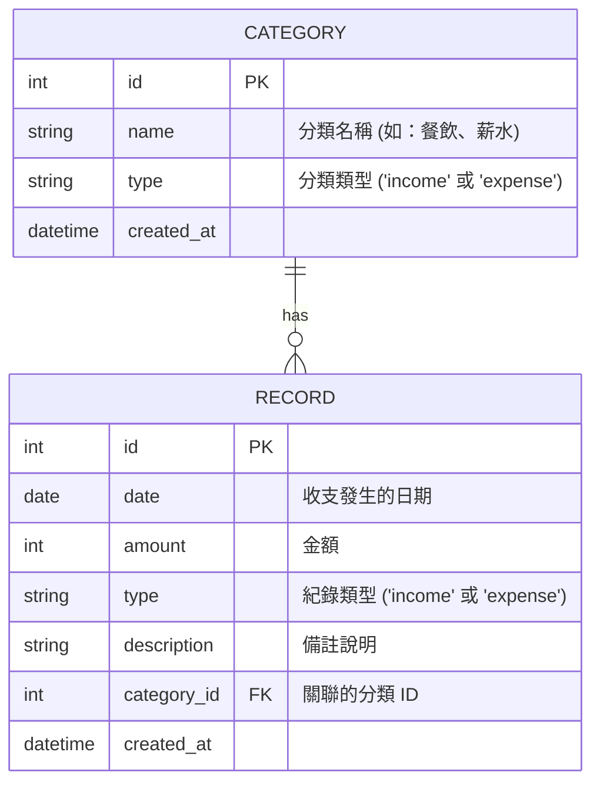

# 資料庫設計文件 - 個人記帳簿系統

本文件基於系統架構與流程圖，定義 SQLite 資料庫的資料表結構與關聯，並提供對應的建表語法。

## 1. ER 圖（實體關係圖）

系統包含兩個主要實體：收支分類 (Category) 與 收支紀錄 (Record)。一筆收支紀錄必須對應一個分類。

## 2. 資料表詳細說明

### 2.1 categories（收支分類）
儲存使用者定義的支出與收入分類。系統可預設幾筆常見分類，使用者也能自行新增。

| 欄位名稱   | 資料型別 | 屬性 / 約束 | 說明 |
| ---------- | -------- | ----------- | ---- |
| id         | INTEGER  | PK, AUTOINCREMENT | 分類唯一識別碼 |
| name       | TEXT     | NOT NULL    | 分類名稱（如：交通、餐飲、薪水） |
| type       | TEXT     | NOT NULL    | 分類類型：'income' 或 'expense' |
| created_at | DATETIME | DEFAULT CURRENT_TIMESTAMP | 建立時間 |

### 2.2 records（收支紀錄）
儲存使用者的每一筆記帳明細。

| 欄位名稱    | 資料型別 | 屬性 / 約束 | 說明 |
| ----------- | -------- | ----------- | ---- |
| id          | INTEGER  | PK, AUTOINCREMENT | 紀錄唯一識別碼 |
| date        | TEXT     | NOT NULL    | 記帳日期，格式為 YYYY-MM-DD |
| amount      | INTEGER  | NOT NULL    | 收支金額（整數，不考慮小數） |
| type        | TEXT     | NOT NULL    | 紀錄類型：'income' 或 'expense' |
| description | TEXT     |             | 備註或詳細說明（選填） |
| category_id | INTEGER  | FK, NOT NULL | 對應至 categories(id) |
| created_at  | DATETIME | DEFAULT CURRENT_TIMESTAMP | 建立時間 |

## 3. 程式碼結構規劃

為了讓資料庫操作更加容易維護，我們將建立以下 Python Model 檔案於 `app/models/` 目錄中：
- `database.py`: 負責建立 SQLite 資料庫連線、初始化 Schema 的輔助函式。
- `category.py`: 提供 Category 資料表的 CRUD 方法（建立、讀取、更新、刪除）。
- `record.py`: 提供 Record 資料表的 CRUD 方法（包含取得特定月份紀錄、計算餘額等進階查詢）。

資料庫實體檔案將儲存在 `instance/database.db`。建表語法儲存在 `database/schema.sql`。
