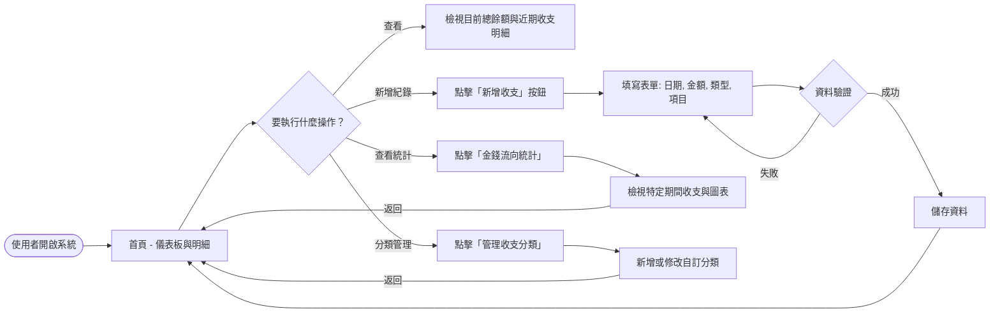
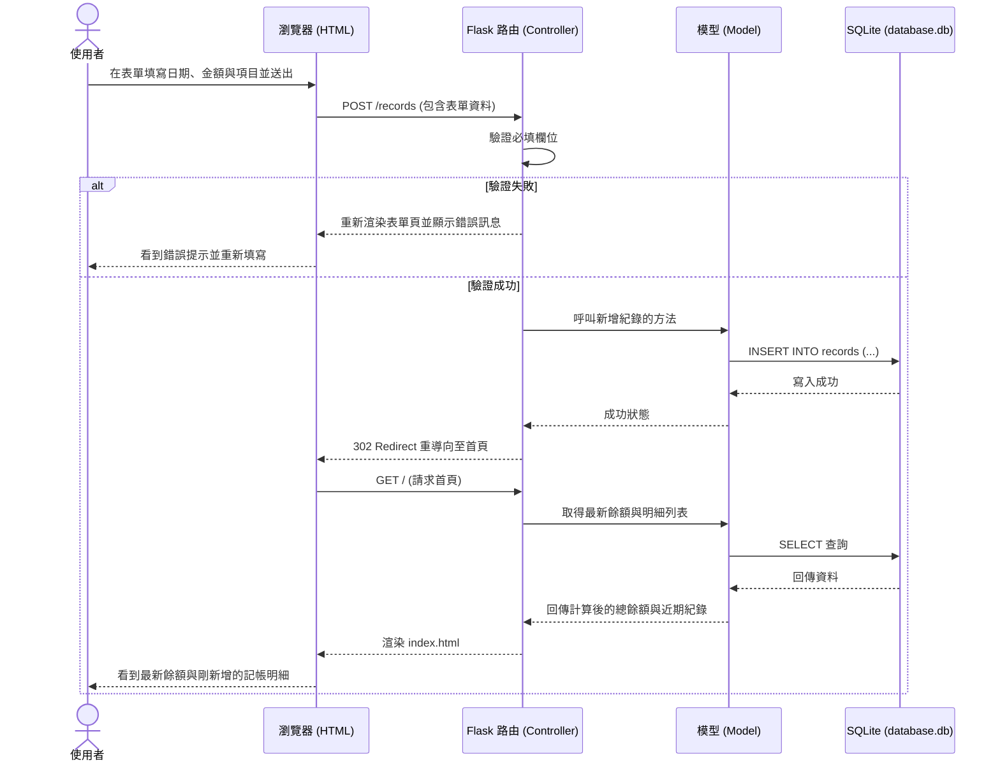

# 流程圖文件 - 個人記帳簿系統

本文件基於 PRD 需求與架構設計，視覺化使用者的操作路徑與系統內的資料流向，確保各項功能與互動皆能正確銜接。

## 1. 使用者流程圖（User Flow）

此流程圖描述使用者進入網站後，可以進行的各項主要操作路徑。

## 2. 系統序列圖（Sequence Diagram）

此序列圖以「新增一筆收支紀錄」為例，展示從使用者點擊送出到資料庫寫入的完整資料流向。

## 3. 功能清單對照表

以下為主要功能對應的預期 URL 路徑與 HTTP 方法。

| 功能名稱 | URL 路徑 | HTTP 方法 | 說明 |
| -------- | -------- | --------- | ---- |
| 首頁與明細列表 | `/` | GET | 顯示目前總餘額與近期的收支紀錄 |
| 顯示新增表單 | `/records/new` | GET | 顯示新增收支紀錄的 HTML 表單 |
| 送出新增紀錄 | `/records` | POST | 接收表單資料並寫入資料庫，完成後導向首頁 |
| 金錢流向統計頁 | `/statistics` | GET | 顯示特定期間的收支統計總和 |
| 分類管理頁面 | `/categories` | GET | 顯示目前的支出與收入分類列表 |
| 新增收支分類 | `/categories` | POST | 接收分類名稱並寫入資料庫 |
